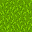
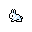
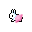
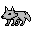
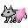

# Wyspa_Wilkow
This is a simple simulation game written using Python and PyGame as well as Object Oriented Programming.

It's goal is to simulate behaviour of wolfs and rabbits on an island.

# How it works
In this game we have 3 factors:
 - Board tiles
 - Rabbits
 - Wolfs
 
 # Board tiles
 Board tiles have two possible states:
<table  align="center">
<tr>
<td>
Grass Tile
</td>
<td>
Desert Tile
</td>
</tr>
<tr>
<td align="center">
   
</td>
<td  align="center">
   
</td>
</tr>
</table>
 
They are a key factor in rabbit simulation because rabbits can feed only on the grass tiles. One a rabbit feeds on grass tile, this tile is replaced with desert tile. Desert tiles can't be fed on but have a possibility to randomly (4-10 ticks) regrow into a grass tile.

# Rabbits
Rabbits have a fat metter that drops down with every step. This forces them to constantly look for grass tiles to feed and replenish their fat. When male and female rabbits meet and their fat level allows it, they mate and create a new rabbit. Mating also decreases their fat level and because of that we implemented a fat treshold below which they cannot mate. Previously it led to multiple deaths. Speaking of death, rabbits also run away from wolfs whenever they are in range of rabbits sight. This chase often ends with rabbit dying of starvation.
<table  align="center">
<tr>
<td>
Male Rabbit
</td>
<td>
Female Rabbit
</td>
</tr>
<tr>
<td align="center">
   
</td>
<td  align="center">
   
</td>
</tr>
</table>

# Wolfs
Similarly to rabbits, they also have a fat metter that drops with every step. Their only source of food are rabbits meaning that even if they "win" by eating all rabbits, they will eventually starve to death. Wolfs have a bigger range of sight than rabbits. Also similarly to rabbits, they can mate depending on their gender and fat level.
 <table  align="center">
<tr>
<td>
Male Wolf
</td>
<td>
Female Wolf
</td>
</tr>
<tr>
<td align="center">
   
</td>
<td  align="center">
   
</td>
</tr>
</table>
 
 
# Authors
<table>
<tr>
<td>
Adam Szałański
</td>
<td>
Łucja Pałkus
</td>
</tr>
<tr>
<td>

</td>
<td>

</td>
</tr>
<tr>
<td align="center">

[![LinkedIn][linkedin-shield]][linkedin-url-adam]

</td>
<td align="center">

[![LinkedIn][linkedin-shield]][linkedin-url-lucja]

</td>
</tr>
</table>

[linkedin-shield]: https://img.shields.io/badge/-LinkedIn-black.svg?style=for-the-badge&logo=linkedin&colorB=555
[linkedin-url-adam]: https://linkedin.com/in/adam-szalanski
[linkedin-url-lucja]: https://www.linkedin.com/in/lucja-palkus/
